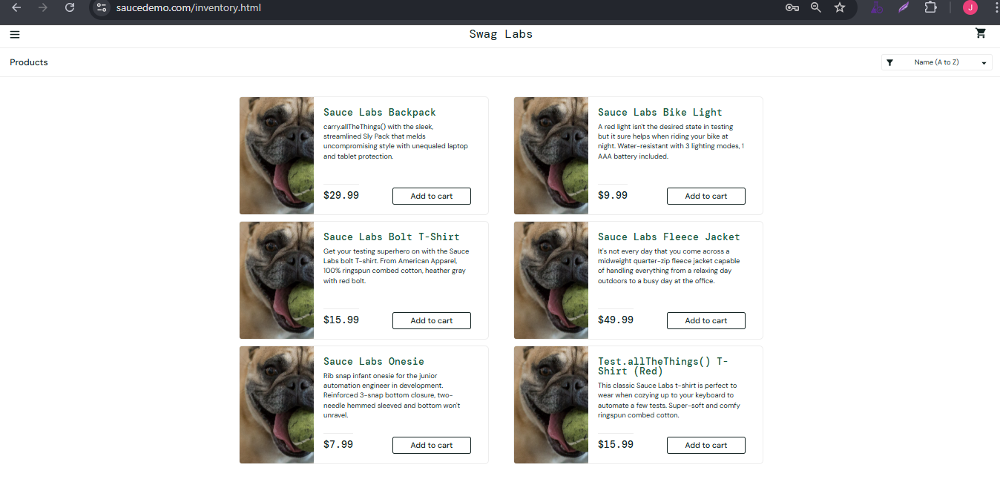

# 🐞 Bug Report

**Bug ID:** BUG_IMG_001

**Title:** All product images show the same dog image (problem_user)  

## 📌 Description
When logged in as 'problem_user', all product images on the inventory page show the same dog image instead of their respective product images.

## 🖥️ Environment
- OS: Windows 10 Pro 64-bit  
- Browser: Google Chrome Versión 139.0.7258.155 (Build oficial) (64 bits)  
- Environment: QA / https://www.saucedemo.com/  

## 🔎 Preconditions
- User logged in with:
  - Username: `problem_user`
  - Password: `secret_sauce`
- User is on the Inventory page (`/inventory.html`).

## 📝 Steps to Reproduce
1. Log in with the above credentials.  
2. Navigate to the Inventory page.  
3. Observe the product images on the inventory page. 

## ✅ Expected Result
- Each product should show its correct image. 

## ❌ Actual Result
- All products show the same dog image

## 📂 Evidence
  

## 🎯 Severity / Priority
- **Severity:** Medium (affects product presentation but app is still usable)  
- **Priority:** Medium  

## 🔗 Related Test Case
[**TC_Product_Navigation_07**](../../02_test_cases/2_product_navigation/product_navigation1.png)

