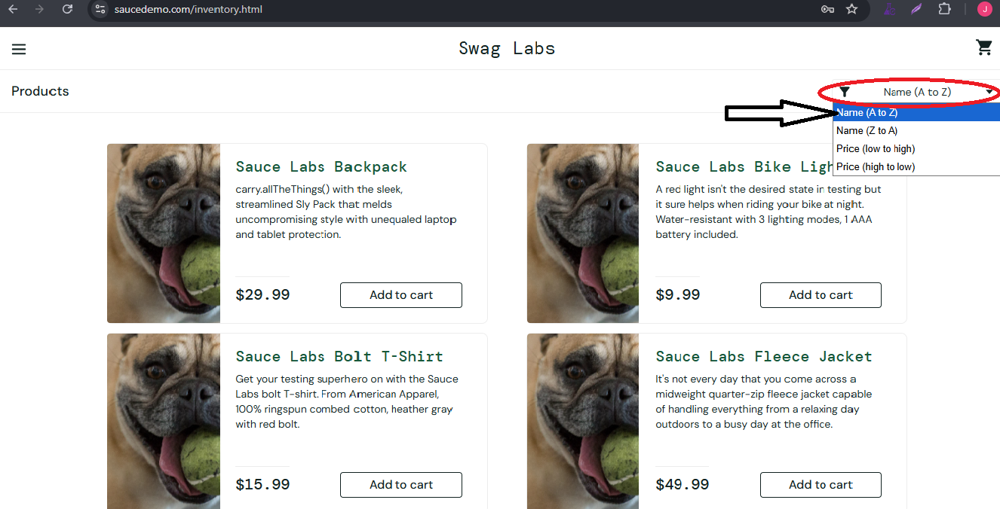

# 🐞 Bug Report

**Bug ID:** BUG_SORTED_002

**Title:** Product sorting by Name (A to Z) does not work

## 📌 Description
when the user select the Name (A to Z) option from the sort dropdown, the products are not ordened alphabetically as expected.

## 🖥️ Environment
- OS: Windows 10 Pro 64-bit  
- Browser: Google Chrome Versión 139.0.7258.155 (Build oficial) (64 bits)  
- Environment: QA / https://www.saucedemo.com/inventory.html  

## 🔎 Preconditions
- User logged in with:
    - Username: `problem_user`
    - password: `secret_sauce`
- User is on the inventory page (`/inventory.html`)

## 📝 Steps to Reproduce
1. Navigate to https://www.saucedemo.com/
2. Enter username: `problem_user`
3. Enter password: `secret_sauce`
4. Click 'Login' button
5. Open the sort dropdown(top rigth)
6. Select Name (A to Z)
7. Observe the product order.

## ✅ Expected Result
- Products should be sorted alphabetically from A-Z.

## ❌ Actual Result
- Products are not correctly sorted alphabetically.

## 📂 Evidence

## 🎯 Severity / Priority
- **Severity:** low (affects product presentation but app is still usable)  
- **Priority:** low  

## 🔗 Related Test Case
- [**TC_Product_Navigation_08**](../../02_test_cases/2_product_navigation/product_navigation1.png)