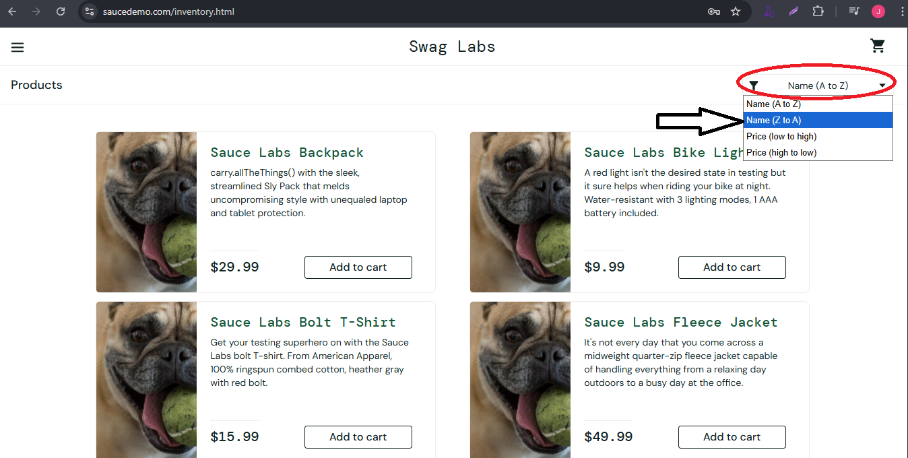

# 🐞 Bug Report

**ID BUG:** BUG_SORTED_003

**Title:** Product sorting by NAME (Z-A) does not work

## 📌 Descripcion
When the user select the Name (Z-A) option from sort dropdown, the products are not ordered alphabetically as expected.
This issue occurs with users `problem_user` / `error_user`

## 🖥️ Environment
- OS: Windows 10 Pro 64-bit
- Browser: Google Chrome Versión 139.0.7258.155 (Build oficial) (64 bits)  
- Environment: QA / https://www.saucedemo.com/inventory.html 

## 🔎 Preconditions
- User logged in with:
    - Username: `problem_user` / Password: `secret_sauce`
    - Username: `error_user ` / Password: `secret_sauce`
- User is on the inventory page (`/inventory.html`)

## 📝 Steps to Reproduce
1. Navigate to https://www.saucedemo.com/.
2. Log in with any of the users mentioned in Preconditions.
3. Click 'Login' Button.
4. Open the sort dropdown(top right).
5. Select Name (Z to A).
6. Observe the product order.

## ✅ Expected Result
- Products should be ordered alphabetically from Z-A

## ❌ Actual Result
- Products are not correctly ordered alphabetically.

## 📂 Evidence

## 🎯 Severity / Priority
- **Severity:** low (affects product presentation but app is still usable)  
- **Priority:** low  

## 🔗 Related Test Case
- [**TC_Product_Navigation_09**](../../02_test_cases/2_product_navigation/product_navigation2.png)
- [**TC_Product_Navigation_013**](../../02_test_cases/2_product_navigation/product_navigation2.png)