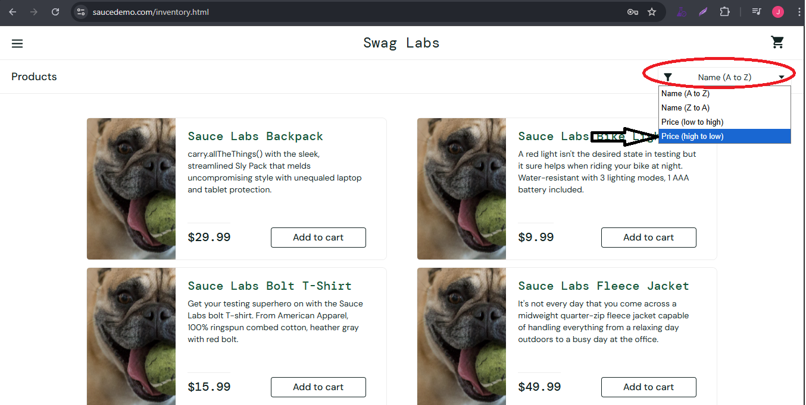

# 🐞 Bug Report

**BUG ID:** BUG_SORTED_HIGH_PRICE_005

**Title:** Products sorting by Price (high to low) does not work

## 📌 Descripcion
When the user select Price (high to low) option from the sort dropdown, the products are not ordened by price as expected.

## 🖥️ Environment
- OS: Windows 10 Pro 64-bit  
- Browser: Google Chrome Versión 139.0.7258.155 (Build oficial) (64 bits)  
- Environment: QA / https://www.saucedemo.com/inventory.html 

## 🔎 Preconditions
- User logged in with:
    - Username: `problem_user`
    - Password: `secret_sauce`
- User is on the inventory page (`/inventory.html`)

## 📝 Steps to Reproduce
1. Navigate to https://www.saucedemo.com/
2. Enter username: `problem_user`
3. Enter password: `secret_sauce`
4. Click 'Login' button
5. Open the sort dropdown(top right)
6. Select Price (high to low)
7. Observe the product order by price.

## ✅ Expected Result
- Products should be ordered by price from high to low.

## ❌ Actual Result
- Products are not correctly ordered by price.

## 📂 Evidence

## 🎯 Severity / Priority
- **Severity:** low (affects product presentation but app is still usable)  
- **Priority:** low  

## 🔗 Related Test Case
- [**TC_Product_Navigation_11**](../../02_test_cases/2_product_navigation/product_navigation2.png)

