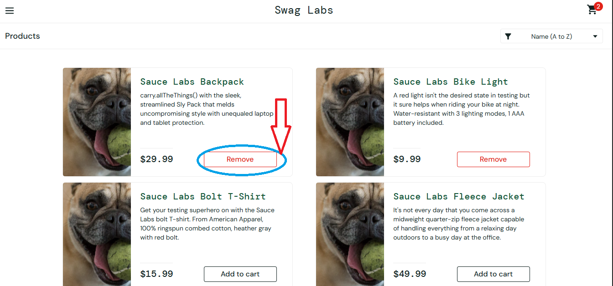

# 🐞 Bug Report

**BUG ID:** BUG_SHOPPING_CART_001

**Title:** Remove button does not remove product from cart

## 📌 Description
When the user tries to remove a product from the inventory page using the `Remove` button, the product is not removed from the cart and the counter does not decrease.

## 🖥️ Environment
- OS: Windows 10 Pro 64-bit  
- Browser: Google Chrome Versión 139.0.7258.155 (Build oficial) (64 bits)  
- Environment: QA / https://www.saucedemo.com/inventory.html 

## 🔎 Preconditions
- User logged in with:
    -Username: `problem_user`
    -Password: `secret_sauce`
- User is on the inventory page (`/inventory.html`)

## 📝 Steps to Reproduce
1. Navigate to https://www.saucedemo.com/
2. Username: `problem_user`.
3. Password: `secret_sauce`.
4. Click 'Login' button.
5. Add any product from the inventory.
6. Click the `Remove` button on the same product.
7. Observe the cart and the item list.

## ✅ Expected Result
- The product should be removed from the cart.
- The cart counter should decrease respectively.

## ❌ Actual Result
- Clicking on Remove button does not remove the product.
- The cart counter does no change.

## 📂 Evidence

## 🎯 Severity / Priority
- **Severity:** high (it affects user ability to manage the cart)  
- **Priority:** high 

## 🔗 Related Test Case
- [**TC_PRODUCT_NAVIGATION_06](../../02_test_cases/3_shopping_cart/shopping_cart2.png)