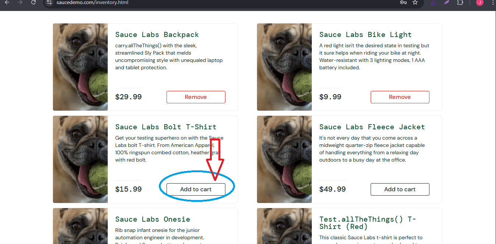

# 🐞 Bug Report

**BUG ID:** BUG_CART_MULTIPLE_ADD_007

**Title:** Cannot add multiple products to cart

## 📌 Description
When the `user` tries to add more than two product to the cart, only the first and second click on Add to Cart works. Subsequent clicks on other products do not add them to the cart.

## 🖥️ Environment
- OS: Windows 10 Pro 64-bit  
- Browser: Google Chrome Versión 139.0.7258.155 (Build oficial) (64 bits)  
- Environment: QA / https://www.saucedemo.com/inventory.html 

## 🔎 Preconditions
- User logged in with:
    -Username: `problem_user`
    -Password: `secret_sauce`
- User is on the inventory page (`/inventory.html`)

## 📝 Steps to Reproduce
1. Navigate to https://www.saucedemo.com/
2. Username: `problem_user`.
3. Password: `secret_sauce`.
4. Click 'Login' button.
5. Add the first product to the cart (works correctly).
6. Add the second product to the cart (works correctly).
7. Tries to add the third product.
8. Observe the cart counter and the items list.

## ✅ Expected Result
- Each click on `Add to cart` button should add the selected product.
- The cart counter should increase correctly.

## ❌ Actual Result
- Only the first and second product is added.
- The cart counter does not increase after the first and second addition.

## 📂 Evidence

## 🎯 Severity / Priority
- **Severity:** high (it affects user ability to manage the cart)  
- **Priority:** high 

## 🔗 Related Test Case
- [**TC_PRODUCT_NAVIGATION_07](../../02_test_cases/3_shopping_cart/shopping_cart2.png)